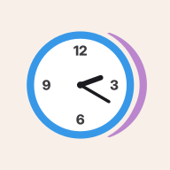
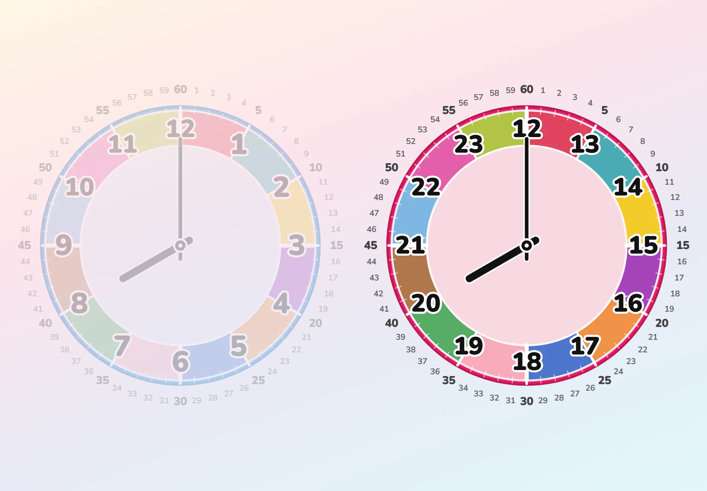

# Futatoki the Learning Clock



A free, open-source 24-hour analog clock for kids learning to tell time. No install, no sign-up — runs in any browser. Affectionately known as *Futatoki the Clock*, or just *Futatoki*.

🌐 [Try it live](https://play.futatoki.app/?lang=en) · 📖 [Learn more](https://futatoki.app/en/) · 📚 [Usage guide](https://futatoki.app/en/guide)

## Why another clock app?

Targets kids who read digital clocks fluently but can't yet parse analog ones. The design removes common sources of confusion and adds explicit anchors for early learners.

* Clockwise-only hand motion — no backward rotation
* Two parallel 12-hour faces (AM / PM) — same hour mapped to two distinct positions
* Schedule icons placed on dial positions — clock time anchored to a child's daily routine
* Color rings as an optional helper layer — disable-able once not needed

## Features

* 🌓 **AM/PM stack & split** — one 12-hour face, or two parallel faces for both halves of the day
* 🕛 **True 24-hour design** — AM face untouched (1–12); PM side adds 13–23
* ☀️ **Visible clock-hand movement** — a full day in ~24 seconds; sun and moon arc across a shifting sky
* 🔄 **Drag-anywhere spinning** — free rotation from any spot on screen; one-handed phone use works
* 🔢 **Three reading stages** — *Badge × Simple* → *Slices × Detailed* (1–60 minute marks) → *Slices × Simple*
* 🎨 **Color as helper lines** — six palettes (incl. colorblind-friendly), as temporary scaffolding
* 📌 **Activity drops** — icons on the dial as completed stamps or upcoming events that animate as the clock hand approaches
* 🎲 **Random quiz** — random 15-minute interval, for reading practice
* 📱 **PWA** — installable, offline-capable
* 🌍 **Multilingual** — see [CONTRIBUTING.md](./CONTRIBUTING.md) for status
* 🔒 **No ads, no tracking, no accounts** — fully client-side

## Available languages

Open the app directly in your language:

- [English - https://play.futatoki.app/?lang=en](https://play.futatoki.app/?lang=en)
- [日本語 - https://play.futatoki.app/?lang=ja](https://play.futatoki.app/?lang=ja)
- [Español - https://play.futatoki.app/?lang=es](https://play.futatoki.app/?lang=es)
- [Français - https://play.futatoki.app/?lang=fr](https://play.futatoki.app/?lang=fr)
- [Deutsch - https://play.futatoki.app/?lang=de](https://play.futatoki.app/?lang=de)
- [Italiano - https://play.futatoki.app/?lang=it](https://play.futatoki.app/?lang=it)
- [Português (Brasil) - https://play.futatoki.app/?lang=pt-BR](https://play.futatoki.app/?lang=pt-BR)
- [简体中文 - https://play.futatoki.app/?lang=zh-CN](https://play.futatoki.app/?lang=zh-CN)
- [繁體中文 - https://play.futatoki.app/?lang=zh-TW](https://play.futatoki.app/?lang=zh-TW)
- [한국어 - https://play.futatoki.app/?lang=ko](https://play.futatoki.app/?lang=ko)
- [Русский - https://play.futatoki.app/?lang=ru](https://play.futatoki.app/?lang=ru)
- [Polski - https://play.futatoki.app/?lang=pl](https://play.futatoki.app/?lang=pl)
- [Türkçe - https://play.futatoki.app/?lang=tr](https://play.futatoki.app/?lang=tr)
- [ไทย - https://play.futatoki.app/?lang=th](https://play.futatoki.app/?lang=th)
- [العربية - https://play.futatoki.app/?lang=ar](https://play.futatoki.app/?lang=ar)
- [فارسی - https://play.futatoki.app/?lang=fa](https://play.futatoki.app/?lang=fa)
- [اردو - https://play.futatoki.app/?lang=ur](https://play.futatoki.app/?lang=ur)
- [हिन्दी - https://play.futatoki.app/?lang=hi](https://play.futatoki.app/?lang=hi)
- [বাংলা - https://play.futatoki.app/?lang=bn](https://play.futatoki.app/?lang=bn)
- [Bahasa Indonesia - https://play.futatoki.app/?lang=id](https://play.futatoki.app/?lang=id)

See [CONTRIBUTING.md](./CONTRIBUTING.md) for the maintenance status of each language.

## Tech stack

* [SolidJS](https://www.solidjs.com/) + SVG
* [Vite](https://vitejs.dev/) + [vite-plugin-pwa](https://vite-pwa-org.netlify.app/) for offline support
* [Tailwind CSS](https://tailwindcss.com/)
* [Cloudflare Workers](https://workers.cloudflare.com/) (hosting)
* No backend, no database, no user accounts

## Getting started

### Prerequisites

* [Bun](https://bun.sh/) (project uses `bun.lock`; scripts are run via `bun run`)

### Development

```sh
git clone https://github.com/mrksye/futatoki-app.git
cd futatoki-app
bun install
bun dev
```

### Build

```sh
bun run build
```

### Deploy (Cloudflare Workers)

```sh
bun run deploy
```

This runs `vite build` followed by `wrangler deploy`. Requires a Cloudflare account and `wrangler login`.

## Contributing

Contributions welcome — especially translations. See [CONTRIBUTING.md](./CONTRIBUTING.md) for:

- Officially maintained languages and how community translations work
- How to add a new language
- Code, bug reports, and feature suggestions

## License

MIT — see [LICENSE](./LICENSE)

The names "Futatoki" / "Futatoki the Learning Clock" / "Futatoki the Clock",
logos, branding, and the visual design of the clock face when reproduced
outside the screen-based app are not covered by the MIT License — see
[NOTICE](./NOTICE) for details.

## About

Built by [Mrksye](https://github.com/mrksye), a freelance developer based in Japan.

First released: 2026-04-21
